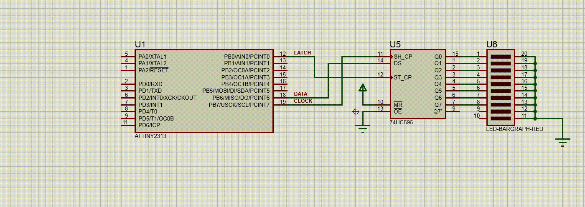

# Shift Register Example with USI module

This project is an example of using the 74HC595 shift register with the AVR ATtiny2313A microcontroller. The code in the project uses the Universal Serial Interface (USI) module on the ATtiny2313A to transmit data to the 74HC595 shift register. The transfer of data is managed using the USI Overflow Interrupt Flag, and once the transfer is completed, a pulse is sent to the LATCH pin to copy the data from the shift register to the storage register. This project demonstrates how to use the 74HC595 shift register in combination with the ATtiny2313A microcontroller to control a series of outputs.

Also see [this](https://github.com/sergeyyarkov/attiny2313a_shift-register-example) example of interaction with a shift register without a USI module
